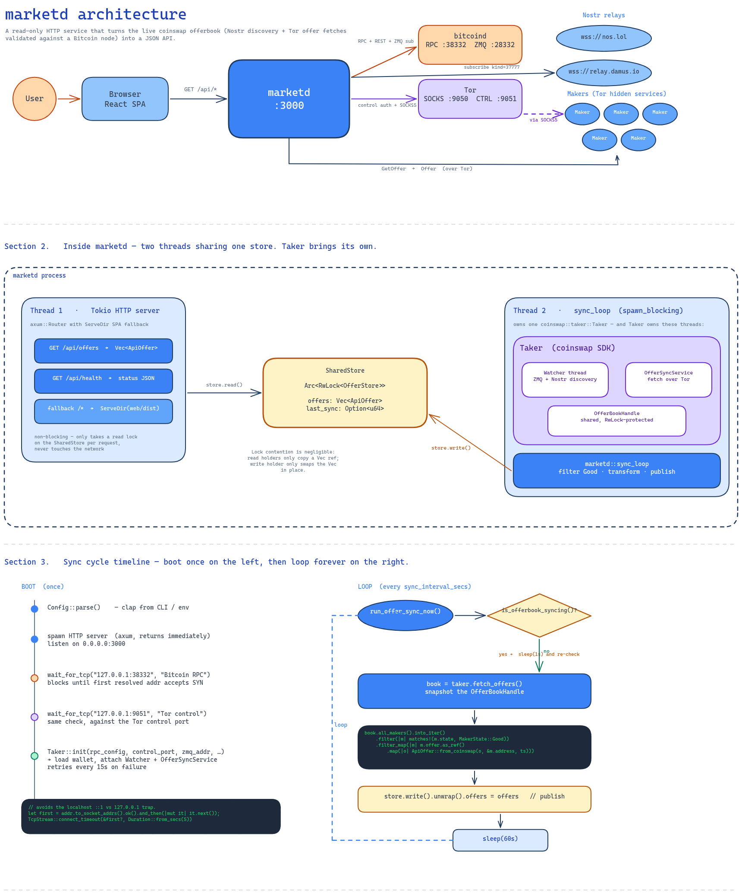

# marketd architecture

`marketd` is a thin HTTP service that turns the coinswap network's live offerbook
into a JSON API and serves a React dashboard on top. It is a **read-only**
aggregator, no swaps, no wallet operations, no maker-side logic. built on top
of the [`coinswap`](https://github.com/citadel-tech/coinswap) `Taker` SDK.



## What it does, in one paragraph

Browsers ask `marketd` for a list of currently-good market offers. `marketd`
keeps that list fresh by running coinswap's `Taker` in the background — which
discovers makers via Nostr, validates their fidelity bonds against a Bitcoin
node, and fetches each maker's offer over Tor. The result is cached in memory
and served to the frontend as JSON. The UI is a Vite-built React SPA bundled
into the same binary and served by `tower_http::ServeDir`.

So most of `marketd`'s shape comes from the **dependencies it pulls in** rather
than from `marketd` itself: a Bitcoin node (RPC + REST + ZMQ), a Tor daemon
(SOCKS + control), Nostr relays for discovery, and Tor hidden-service makers.

## System boundaries

| Boundary                | Direction                          | Purpose                                                                                          |
| ----------------------- | ---------------------------------- | ------------------------------------------------------------------------------------------------ |
| **Browser <-> marketd** | bidirectional                      | HTTP - `GET /api/offers`, `GET /api/health`, plus the SPA assets                                 |
| **marketd -> bitcoind** | outbound JSON-RPC + REST + ZMQ sub | Wallet init, blockchain info, fidelity bond UTXO checks                                          |
| **marketd -> Tor**      | outbound (control + SOCKS5)        | Auth + circuit setup, then proxied connections to onion makers                                   |
| **marketd -> Nostr**    | outbound WSS                       | Subscribe to fidelity announcements (`kind=37777`) on `wss://nos.lol` and `wss://relay.damus.io` |
| **marketd -> makers**   | outbound, via Tor SOCKS5           | `GetOffer` request, receive `Offer` (fee schedule + fidelity bond)                               |

## Internal structure

`marketd` runs **two threads** sharing one in-memory store:

1. **HTTP server:** `tokio` async runtime with `axum`. Serves the SPA and the
   two API endpoints. Reads from the store; never blocks on the network.
2. **Sync loop:** a blocking task spawned via `tokio::task::spawn_blocking`.
   Owns a `coinswap::taker::Taker` instance and writes the store.

The store is `Arc<RwLock<OfferStore>>`. The HTTP thread takes a read lock per
request (cheap), the sync thread takes a write lock once per cycle (also cheap,
because the lock is held only while the new `Vec<ApiOffer>` is moved in).

`Taker::init` itself spawns more threads inside the sync thread's process: a
`Watcher` thread (consumes Bitcoin ZMQ events, runs Nostr discovery), and an
`OfferSyncService` (fetches offers from each discovered maker over Tor). We
treat these as opaque. `marketd` only calls `taker.run_offer_sync_now()` and
`taker.fetch_offers()`.

## Boot sequence

```
1. Parse CLI / env config (clap)
2. Spawn HTTP server (returns immediately, listens on 0.0.0.0:3000)
3. Sync thread:
   a. wait_for_tcp(bitcoin_rpc_url, "Bitcoin RPC")        // blocks until listening
   b. wait_for_tcp("127.0.0.1:tor_control", "Tor control") // blocks until listening
   c. Taker::init(...) in retry loop                       // wallet + ZMQ + Nostr + Tor
   d. enter sync cycle (see below)
```

The `wait_for_tcp` step is critical: it uses **only the first resolved socket
address** (`addr.to_socket_addrs().next()`), matching the behaviour of
`bitcoind::bitcoincore_rpc`'s `simple_http` transport. This avoids a subtle bug
where `localhost` resolves to `::1` first, the multi-address Rust stdlib
`TcpStream::connect` succeeds, but the JSON-RPC client only tries `::1`, fails,
and the wallet init dies with `ConnectionRefused`, even though "the port is
open".

---

## Sync cycle

Once `Taker` is initialised, the sync thread runs:

```rust
loop {
    taker.run_offer_sync_now();                  // kick the OfferSyncService
    while taker.is_offerbook_syncing() {         // wait for it to finish
        thread::sleep(Duration::from_secs(1));
    }
    let book = taker.fetch_offers()?;            // snapshot the OfferBook
    let offers = book.all_makers()
        .into_iter()
        .filter(|m| matches!(m.state, MakerState::Good))
        .filter_map(|m| m.offer.as_ref()
            .map(|o| ApiOffer::from_coinswap(o, &m.address, ts)))
        .collect();
    store.write().unwrap().offers = offers;      // publish atomically
    thread::sleep(Duration::from_secs(cfg.sync_interval_secs));
}
```

The transformation `MakerOfferCandidate -> ApiOffer` is in `state.rs`. It mostly
copies fields, with one workaround: `FidelityBond::outpoint` is `pub(crate)` in
the `coinswap` crate, so we round-trip through `serde_json::Value` to read
`outpoint.txid` and `outpoint.vout`. Once that field is made `pub`, the
workaround can be deleted.

---

## API surface

```
GET /api/offers   ->  200  application/json   ApiOffer[]
GET /api/health   ->  200  application/json   { status, offer_count, last_sync }
GET /*            ->     SPA assets, with index.html as the SPA fallback
```

`ApiOffer` (see `state.rs`):

```jsonc
{
  "address": "<onion-host>:<port>",
  "timestamp": 1735689600,
  "base_fee": 100,
  "amount_relative_fee_pct": 0.1,
  "time_relative_fee_pct": 0.0005,
  "min_size": 10000,
  "max_size": 50000000,
  "required_confirms": 1,
  "minimum_locktime": 144,
  "tweakable_point": "<hex pubkey>",
  "fidelity_bond": {
    "amount": 50000,
    "outpoint": { "txid": "<hex>", "vout": 0 },
    "lock_time": 905000,
    "cert_hash": "<hex>",
    "cert_sig": "<hex DER>"
  }
}
```

---

## Deployment

Three containers, all on `network_mode: host` so they reach each other at
`127.0.0.1:<port>`:

| Service    | Image                  | Ports                           | Role                                            |
| ---------- | ---------------------- | ------------------------------- | ----------------------------------------------- |
| `bitcoind` | `bitcoin/bitcoin:28`   | 38332 (RPC + REST), 28332 (ZMQ) | `-rest -txindex=1 -zmqpubrawtx -zmqpubrawblock` |
| `tor`      | `osminogin/tor-simple` | 9050 (SOCKS), 9051 (control)    | Hashed control password                         |
| `marketd`  | this repo              | 3000 (HTTP)                     | Aggregator + SPA                                |

`./run.sh dev` brings up all three; `./run.sh prod` runs an interactive wizard
that lets you swap any of them for an external instance.

---

## What's deliberately NOT here

- **No wallet operations**, even though `Taker::init` creates a wallet file.
  The wallet is only needed to satisfy the `Taker` constructor — `marketd` never
  signs, spends, or holds keys you'd care about.
- **No swap logic.** `do_coinswap`, `recover_from_swap`, etc. are unused.
- **No persistence beyond the offerbook.** `~/.coinswap/marketd/offerbook.json`
  is written by `Taker`'s background service; `marketd` itself keeps no state.
- **No auth on `/api/*`.** It's a public read-only feed.
